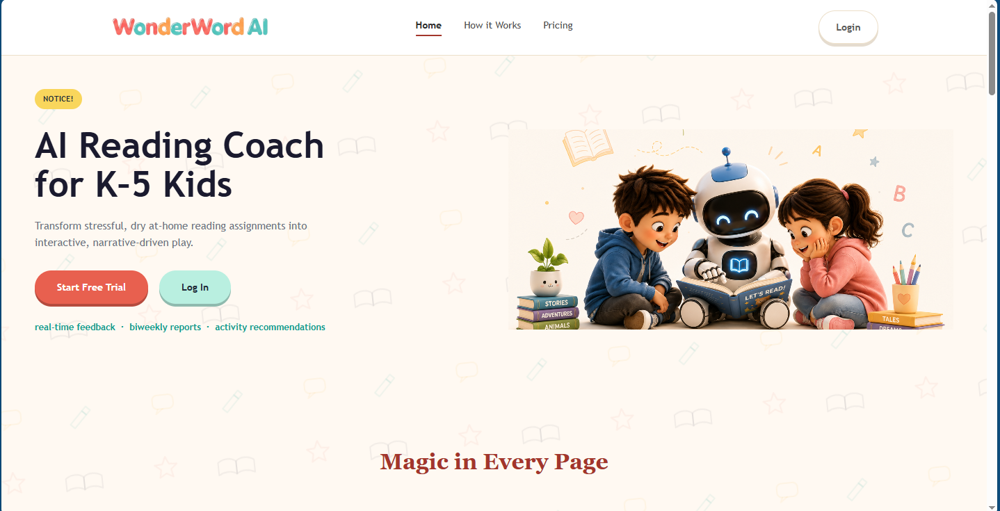
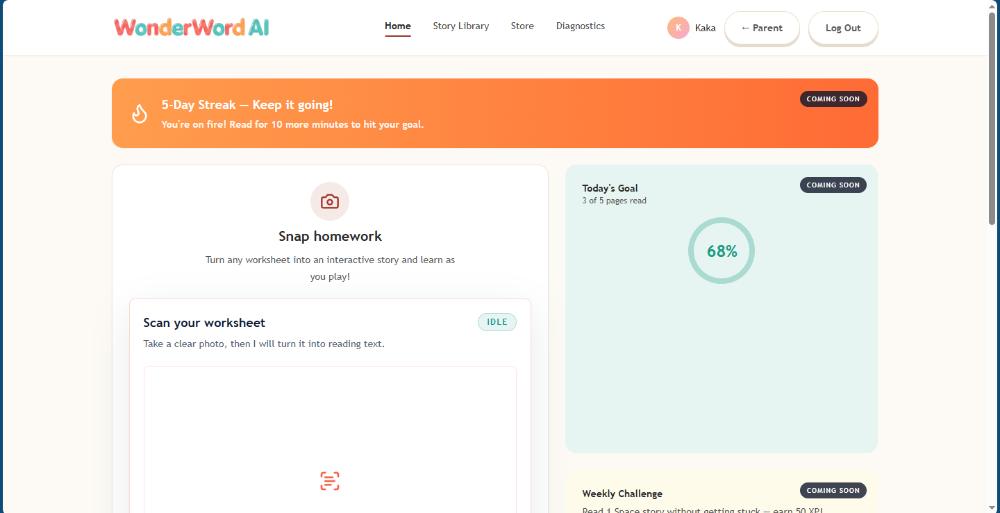
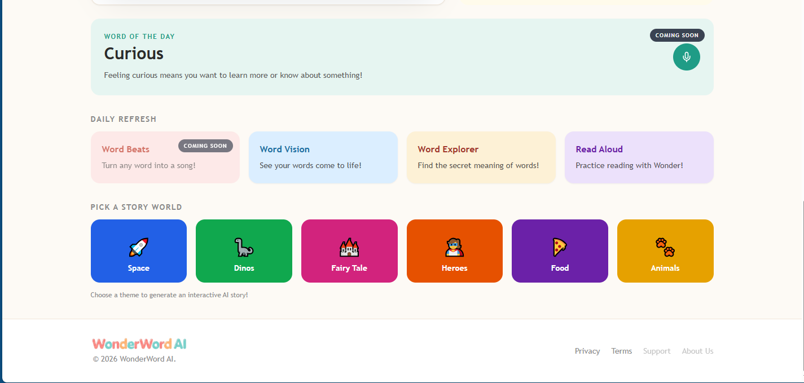
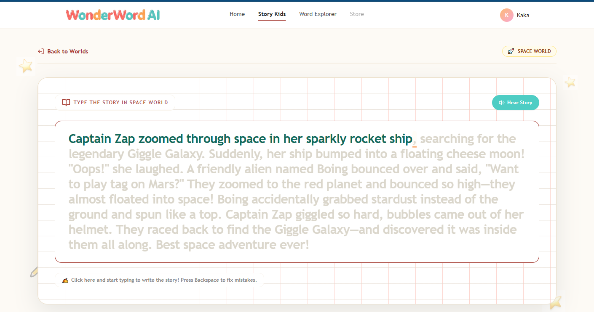
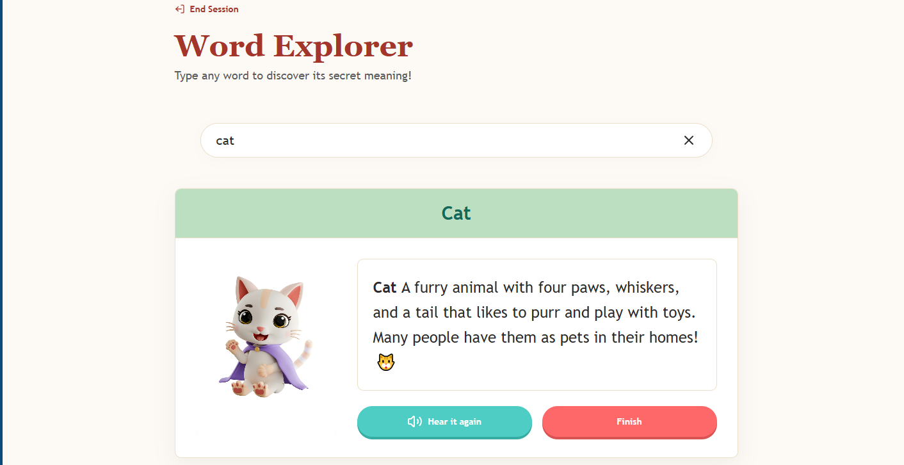

# 📚 WonderWord AI

> **AI-Powered Reading Coach for K-5 Kids**  
> *Transforming stressful, dry at-home reading assignments into interactive, narrative-driven play.*

Developed under the **Product Manager Accelerator** program by an international cross-functional team.

---

## 📸 Overview & Screenshots

| Landing Page | Homework Scanner & Dashboard |
| :---: | :---: |
|  |  |

| Word of the Day & Story Worlds | Interactive Read-Aloud (Karaoke Mode) |
| :---: | :---: |
|  |  |

  <b>Word Explorer (Kid-Friendly Dictionary)</b> 
  

---

## ✨ Key Features

- **📷 Snap Homework (AI Worksheet Scan):** Snap a picture of any printed worksheet or book page to convert it instantly into interactive reading material using Vision AI (Anthropic Claude).
- **🎤 Real-Time Karaoke & Speech Alignment:** Word-by-word highlighted playback and speech alignment built on WhisperX and Web Audio API.
- **🚀 Narrative Story Worlds:** Generate custom interactive AI stories tailored to children's interests (Space, Dinosaurs, Fairy Tales, Heroes, Food, Animals).
- **🔍 Word Explorer & Phonics Engine:** Tap or search any word to reveal visual definitions, child-friendly explanations, and phonetic pronunciations.
- **🏆 Gamification & Daily Streaks:** Keep children motivated with daily reading streaks, weekly challenges, and progress goals.
- **📊 Parent Dashboard & Analytics:** Comprehensive parent portal for tracking reading frequency, vocabulary expansion, and biweekly progress insights.

---

## 🛠️ Tech Stack

### **Frontend & Web Application (`/apps/web`)**
- **Framework:** [Next.js 14](https://nextjs.org/) (App Router, Server Components & Client Boundaries)
- **Language:** TypeScript
- **Styling:** Tailwind CSS, PostCSS
- **Server State Management:** TanStack Query (React Query v5)
- **UI Components & Charts:** Lucide React, Recharts
- **Quality & Testing:** Vitest (Unit & Integration), Playwright (E2E Testing)

### **Backend & Database**
- **Database & Auth:** [Supabase](https://supabase.com/) (PostgreSQL with RLS - Row Level Security, Supabase Auth)
- **Payments:** Stripe Integration

### **Machine Learning & AI Service (`/apps/ml-service`)**
- **Framework:** FastAPI (Python 3.11+)
- **Speech-to-Text & Alignment:** [WhisperX](https://github.com/m-bain/whisperX) + PyTorch
- **Generative AI & LLMs:** Anthropic Claude API (Vision & Story Generation), OpenAI API
- **NLP & Phonics:** Phonemizer, spaCy, Sentence-Transformers, Textstat
- **Monitoring:** Sentry SDK

---

## 🌍 International Team & Origin

This project was built as part of the **Product Manager Accelerator** program by an international team working across multiple time zones.

For original commit history, code governance, and team structure, please refer to the original repository and [`.github/CODEOWNERS`](.github/CODEOWNERS).

**Team Members:**
- [@Matheus-Emanue123](https://github.com/Matheus-Emanue123)
- [@anderpudding](https://github.com/anderpudding)
- [@anvitaindrakanty](https://github.com/anvitaindrakanty)
- [@Kayke-Queiroz](https://github.com/Kayke-Queiroz)

---

## 📄 License

This repository is maintained for demonstration purposes under the **Product Manager Accelerator** project framework. Refer to the original repository for full license details.
